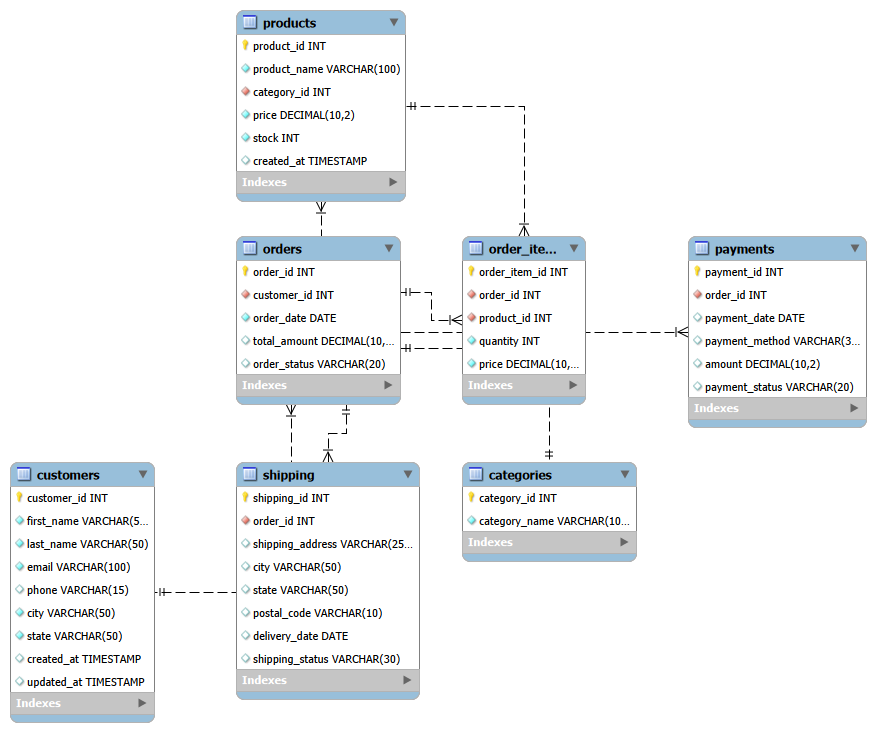

# E-Commerce SQL Analysis Project

A complete **MySQL-based E-Commerce Database and Business Analysis Project** demonstrating relational database design, SQL querying, data analysis, views, stored procedures, triggers, indexes, and data-quality validation.

---

## Project Overview

This project simulates an e-commerce business database containing customers, products, categories, orders, order items, payments, and shipping information.

The main goal of this project is to use SQL to manage the database and answer real-world business questions related to sales, customers, products, revenue, orders, payments, and inventory.

---

## Business Objectives

This project answers business questions such as:

- What is the total revenue?
- How many orders have been placed?
- What is the average order value?
- Who are the top customers by spending?
- Which products sell the most?
- Which products generate the highest revenue?
- Which categories generate the most revenue?
- Which products have low stock?
- Which customers have never placed an order?
- Which products have never been ordered?
- What payment methods are most commonly used?
- How does revenue change over time?
- Are there any invalid or inconsistent records?

---

## Database Structure

The database contains the following main tables:

| Table | Description |
|---|---|
| `customers` | Stores customer information |
| `categories` | Stores product categories |
| `products` | Stores product details, prices, and inventory |
| `orders` | Stores customer order information |
| `order_items` | Stores products included in each order |
| `payments` | Stores payment information |
| `shipping` | Stores shipping information |

---

## ER Diagram

The following ER diagram represents the relationships between the database tables.



---

## SQL Views

The project contains analytical views for frequently used queries:

| View | Purpose |
|---|---|
| `category_revenue` | Analyzes revenue generated by each category |
| `complete_order_details` | Provides complete order information |
| `customer_orders` | Displays customer order information |
| `customer_spending` | Analyzes customer spending |
| `delivered_orders` | Displays delivered orders |
| `low_stock_products` | Identifies products with low inventory |
| `product_details` | Provides detailed product information |
| `product_revenue` | Analyzes revenue generated by products |

---

## Advanced SQL Features

### Stored Procedures

Stored procedures are used to create reusable database operations such as retrieving and filtering product information.

### Triggers

Triggers are used for automatic inventory-related operations, including:

- Reducing product stock after an order item is added
- Restoring product stock after an order item is deleted
- Preventing negative product stock

### Indexes

Indexes were created on frequently searched columns to improve query performance.

Examples include:

- Customer email
- Order customer ID
- Order date
- Product category
- Product name

### Query Optimization

The `EXPLAIN` statement is used to analyze query execution plans and understand how indexes can improve query performance.

---

## Business Analysis

The project includes SQL analysis for:

### Sales Analysis

- Total revenue
- Total orders
- Average order value
- Monthly revenue
- Revenue by category
- Revenue by payment method

### Customer Analysis

- Top customers by spending
- Customer order frequency
- Average customer spending
- Customers with no orders

### Product Analysis

- Best-selling products
- Top products by revenue
- Most expensive products
- Products never ordered
- Low-stock products

### Order Analysis

- Orders by status
- High-value orders
- Complete order details
- Payment analysis

---

## Data Quality & Validation

The project includes SQL checks to identify:

- Duplicate customer records
- Invalid product prices
- Negative inventory
- Invalid order quantities
- Invalid payment amounts
- Missing relationships
- NULL values
- Order-total mismatches
- Payment-total mismatches

These checks help ensure that the database contains accurate and consistent data.

---

## SQL Concepts Demonstrated

This project demonstrates the following SQL concepts:

- Database creation
- Table creation
- Primary keys
- Foreign keys
- Constraints
- INSERT
- UPDATE
- DELETE
- SELECT
- WHERE
- ORDER BY
- GROUP BY
- HAVING
- Aggregate functions
- INNER JOIN
- LEFT JOIN
- Subqueries
- Common Table Expressions (CTEs)
- Window Functions
- SQL Views
- Stored Procedures
- Triggers
- Indexes
- EXPLAIN
- Query Optimization
- Data Quality Validation
- Business Analysis

---

## Project Structure

```text
Ecomeres-SQL-Project/
│
├── .gitignore
├── LICENSE
├── README.md
│
├── screenshots/
│   └── ER-diagram.png
│
└── sql/
    ├── 01_Create_database.sql
    ├── 02_Create_tables.sql
    ├── 03_Insert_sample_data.sql
    ├── 04_Basic_queries.sql
    ├── 05_Joins.sql
    ├── 06_Groupby_having.sql
    ├── 07_subqueries.sql
    ├── 08_Cte.sql
    ├── 09_Window_function.sql
    ├── 10_Views.sql
    ├── 11_Stored_procedure.sql
    ├── 12_Triggers.sql
    ├── 13_Indexes.sql
    ├── 14_business_analysis.sql
    └── 15_data_quality.sql
```

---

## Technologies Used

- **MySQL 8.0**
- **SQL**
- **VS Code**
- **Git**
- **GitHub**

---

## How to Run the Project

### 1. Clone the repository

```bash
git clone YOUR_GITHUB_REPOSITORY_URL
```

### 2. Open the project

Open the cloned project folder in VS Code or MySQL Workbench.

### 3. Create the database

Run:

```text
sql/01_Create_database.sql
```

### 4. Create the tables

Run:

```text
sql/02_Create_tables.sql
```

### 5. Insert sample data

Run:

```text
sql/03_Insert_sample_data.sql
```

### 6. Run SQL analysis

The remaining SQL files can be executed to explore:

- Basic queries
- Joins
- Grouping
- Subqueries
- CTEs
- Window functions
- Views
- Stored procedures
- Triggers
- Indexes
- Business analysis
- Data-quality checks

---

## Analysis Workflow

The project follows this SQL workflow:

```text
Database Creation
       ↓
Table Design
       ↓
Sample Data
       ↓
Basic SQL Queries
       ↓
Joins
       ↓
GROUP BY & HAVING
       ↓
Subqueries
       ↓
CTEs
       ↓
Window Functions
       ↓
Views
       ↓
Stored Procedures
       ↓
Triggers
       ↓
Indexes & Optimization
       ↓
Business Analysis
       ↓
Data Quality Validation
```

---

## Key Learning Outcomes

Through this project, I practiced:

- Designing relational databases
- Working with multiple related tables
- Writing complex SQL queries
- Performing business-oriented data analysis
- Using advanced SQL features
- Optimizing database queries
- Validating data quality
- Managing SQL projects using Git and GitHub

---

## Future Improvements

Possible future improvements include:

- Building an interactive Power BI dashboard
- Connecting the database with Python
- Adding more realistic transactional data
- Creating automated reports
- Performing customer segmentation
- Adding sales forecasting
- Building an end-to-end data analytics pipeline

---

##  Author

**Rituraj Kumar**

B.Tech Computer Engineering

### GitHub

https://github.com/ritura17

### LinkedIn

http://www.linkedin.com/in/rituraj-kumar-2748982a8